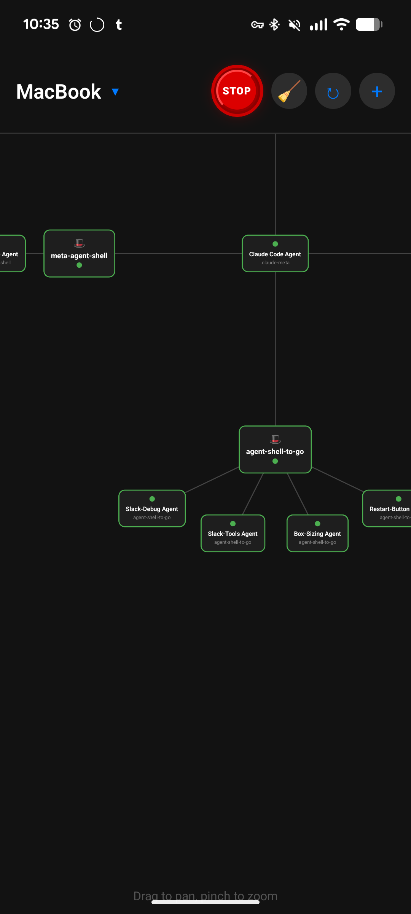

# agent-shell-to-go

Take your [agent-shell](https://github.com/xenodium/agent-shell) sessions anywhere. Monitor and control your AI agents from your phone.

Pairs well with [meta-agent-shell](https://github.com/ElleNajt/meta-agent-shell) for coordinating multiple agents.

## Security Model

**This tool uses Tailscale as its only security boundary.** The backend exposes an unauthenticated HTTP+WebSocket API that can:

- Inject arbitrary prompts into your AI agents (which run with your shell privileges)
- Read files within active project directories
- Spawn new agents in specified directories
- Kill or restart agent processes

**Anyone on your Tailscale network has full access.** This is the entire trust model.

### What You're Trusting

| Trust Boundary | Implication |
|----------------|-------------|
| **Tailscale network** | Every device on your tailnet can control your agents |
| **Expo Go** | Development builds are served over the network |
| **Your phone** | If compromised, attacker has the backend URL |

### Recommendations

- Only use on Tailscale networks where you control all devices
- Don't share your tailnet with untrusted parties
- Be aware that phone compromise = agent compromise
- The SQLite database stores conversation history in plaintext

This is a reasonable model for a **personal, single-user tool**. If you need stronger isolation, consider adding token authentication (the infrastructure exists but is disabled).

## Dendrite (Mobile App)

The primary interface is **Dendrite**, a React Native mobile app with a Go backend.



```
Mobile App (React Native)
    │
    ├── WebSocket ──► Backend (machine 1) ◄── Emacs
    │
    └── WebSocket ──► Backend (machine 2) ◄── Emacs
```

### Quick Start

```bash
./start.sh
```

Scan the QR code with Expo Go on your phone.

### Features

- Graph view of all agent sessions
- Real-time message streaming
- Send messages to agents from your phone
- Stop/close agents remotely
- Multi-machine support (switch between different Emacs instances)
- File browser for project files

### Multi-Machine Setup

On each machine:
```bash
cd dendrite/backend
./start-backend.sh
```

In the app, tap the machine name → "Add Machine" → enter the backend URL.

See [dendrite/README.md](dendrite/README.md) for full documentation.

## Slack Transport (Deprecated)

The Slack transport still works but is no longer actively developed. It mirrors agent-shell conversations to Slack threads.

### Setup

1. Create a Slack app using [`slack-app-manifest.yaml`](slack-app-manifest.yaml)
2. Configure credentials:

```elisp
(use-package agent-shell-to-go
  :load-path "~/code/agent-shell-to-go"
  :after agent-shell
  :config
  (setq agent-shell-to-go-slack-bot-token "xoxb-...")
  (setq agent-shell-to-go-slack-channel-id "C...")
  (setq agent-shell-to-go-slack-app-token "xapp-...")
  (setq agent-shell-to-go-slack-user-id "U...")  ; auto-populates authorized-users
  
  (agent-shell-to-go-setup))
```

Full setup instructions: [slack.org](slack.org)

## Architecture

See [ARCHITECTURE.md](ARCHITECTURE.md) for the pluggable transport system.

## Related Projects

- [meta-agent-shell](https://github.com/ElleNajt/meta-agent-shell) - Supervisory agent for coordinating multiple sessions

## License

GPL-3.0
